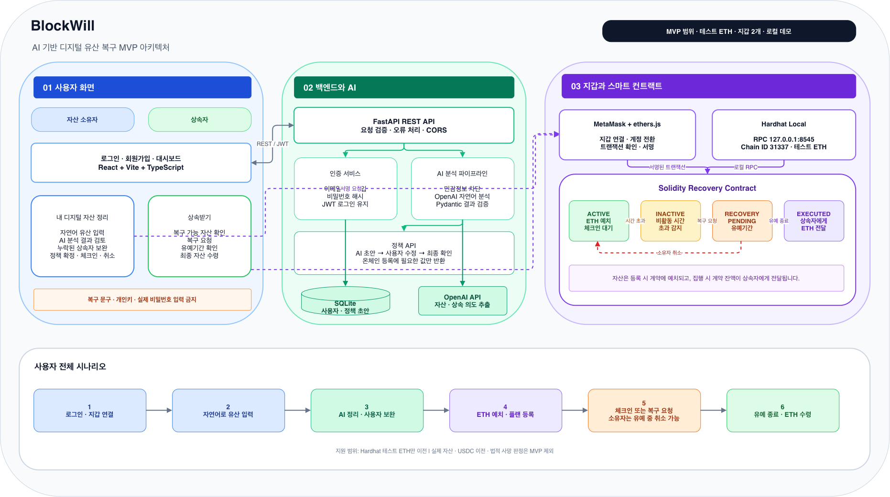

# BlockWill

**Gemini AI와 스마트 컨트랙트를 이용한 디지털 유산 설계·복구 로컬 MVP**

BlockWill은 사용자가 자연어로 디지털 자산과 상속 의도를 정리하고, 검토한 복구 계획을 MetaMask로 등록한 뒤, 일정 기간 활동이 없을 때 지정된 상속자가 예치된 테스트 ETH를 수령하는 과정을 검증한 프로젝트입니다.

현재 버전은 **로컬 개발 환경에서 전체 흐름을 재현하는 MVP**입니다. 실제 사망을 판정하거나 법적 상속 절차를 대신하지 않으며, 실제 자산 대신 Hardhat 테스트 ETH를 사용합니다.

## 주요 기능

- SQLite 기반 회원가입 및 로그인
- Argon2 비밀번호 해시와 JWT HttpOnly 쿠키 인증
- Gemini 기반 디지털 자산·상속 의도 구조화 분석
- 상속 대상 누락과 서로 충돌하는 지시 탐지
- AI 결과의 원문 근거 검증 및 민감정보 입력 차단
- MetaMask 계정·네트워크·테스트 ETH 잔액 확인
- 테스트 ETH 예치형 복구 계획 생성
- 소유자 활동 확인(Check-in)
- 상속자의 복구 요청과 소유자의 요청 취소
- 유예기간 종료 후 상속자의 테스트 ETH 수령

## 사용자 시나리오

~~~mermaid
flowchart LR
    A[회원가입·로그인] --> B[MetaMask 연결]
    B --> C[자연어로 자산과 상속 의도 입력]
    C --> D[Gemini 분석]
    D --> E[충돌·누락·원문 근거 검토]
    E --> F[복구 계획과 테스트 ETH 등록]
    F --> G[소유자 Check-in]
    G --> H[비활동 기간 경과]
    H --> I[상속자 복구 요청]
    I --> J{유예기간 중 취소?}
    J -->|소유자 취소| G
    J -->|취소 없음| K[상속자 최종 실행]
    K --> L[예치된 테스트 ETH 수령]
~~~

## 시스템 구조

~~~text
사용자 브라우저
├── React + TypeScript
│   ├── 회원가입·로그인 UI
│   ├── 디지털 유산 분석 UI
│   └── 복구 계획·상속 실행 UI
│
├── FastAPI (127.0.0.1:8001)
│   ├── SQLite 사용자 저장
│   ├── Argon2 + JWT 인증
│   ├── 입력 보안 검사
│   └── Gemini 구조화 분석
│
└── MetaMask
    └── Hardhat Local Network (127.0.0.1:8545)
        └── RecoveryVault.sol
~~~

LLM과 블록체인 실행 권한은 분리되어 있습니다. Gemini는 자산 정보를 정리할 뿐 MetaMask 서명, 개인키 조회, 스마트 컨트랙트 실행 또는 자산 전송을 수행할 수 없습니다.

## 기술 스택

| 영역 | 기술 |
|---|---|
| Frontend | React 19, TypeScript, Vite, CSS |
| Wallet | MetaMask, ethers.js 6 |
| Backend | Python 3.11, FastAPI, Pydantic |
| Authentication | Argon2, JWT, HttpOnly Cookie |
| Database | SQLite |
| LLM | Gemini API, OpenAI SDK 호환 API, Structured Outputs |
| Smart Contract | Solidity 0.8.34, Hardhat 3 |
| Test | pytest, Mocha, Chai, Hardhat |

## 프로젝트 구조

~~~text
BlockWill/
├── backend/
│   ├── app/
│   │   ├── main.py          # FastAPI와 API 라우트
│   │   ├── auth.py          # 비밀번호 해시와 JWT
│   │   ├── database.py      # SQLite 사용자 저장
│   │   ├── estate.py        # Demo/OpenAI/Gemini 분석
│   │   ├── models.py        # 요청·응답 데이터 모델
│   │   └── security.py      # 비밀정보 차단과 개인정보 제거
│   ├── examples/            # API 요청 예시
│   └── tests/               # 백엔드 테스트
├── blockchain/
│   ├── contracts/
│   │   └── RecoveryVault.sol
│   ├── ignition/modules/    # Hardhat 배포 모듈
│   └── test/                # 스마트 컨트랙트 테스트
├── frontend/
│   └── src/
│       ├── api/             # 인증·지갑·컨트랙트 호출
│       ├── components/      # 지갑과 복구 계획 UI
│       └── App.tsx          # 사용자 화면 흐름
├── docs/devlog/             # 스프린트별 개발 기록
└── scripts/                 # 백엔드 실행·테스트 스크립트
~~~

## 시작하기

### 1. 준비물

- Git
- Python 3.11 이상
- Node.js 22 이상 권장
- npm
- MetaMask 브라우저 확장 프로그램
- Gemini 분석을 사용할 경우 Google AI Studio API 키

실제 ETH는 필요하지 않습니다. 로컬 Hardhat 테스트 계정과 테스트 ETH만 사용합니다.

### 2. 저장소와 의존성 설치

~~~bash
git clone https://github.com/seungeun18/BlockWill.git
cd BlockWill

python3 -m venv .venv
source .venv/bin/activate
.venv/bin/python -m pip install -r backend/requirements-lock.txt

npm --prefix frontend ci
npm --prefix blockchain ci
~~~

### 3. 백엔드 환경변수 설정

~~~bash
cp .env.example .env
openssl rand -hex 32
~~~

openssl이 출력한 값을 .env의 JWT_SECRET에 입력합니다.

API 키 없이 규칙 기반 분석을 사용하려면 다음과 같이 설정합니다.

~~~env
LLM_PROVIDER=demo
JWT_SECRET=32자_이상의_임의_문자열
~~~

Gemini 분석을 사용하려면 [Google AI Studio](https://aistudio.google.com/apikey)에서 키를 발급하고 다음과 같이 설정합니다.

~~~env
LLM_PROVIDER=gemini
GEMINI_API_KEY=발급받은_API_키
GEMINI_MODEL=gemini-3.5-flash-lite
JWT_SECRET=32자_이상의_임의_문자열
~~~

.env는 Git에서 제외됩니다. API 키, 지갑 개인키와 복구 문구를 .env.example, README 또는 소스 코드에 기록하지 마세요.

### 4. 로컬 블록체인 실행

첫 번째 터미널에서 실행합니다.

~~~bash
cd blockchain
npm run node
~~~

로컬 노드가 실행되는 동안 이 터미널을 종료하지 마세요. 노드를 종료하면 배포한 컨트랙트와 생성한 Plan이 사라집니다.

### 5. RecoveryVault 배포

새 터미널에서 한 번 실행합니다.

~~~bash
cd blockchain
npx hardhat ignition deploy ignition/modules/RecoveryVault.ts \
  --network localhost \
  --reset
~~~

출력된 RecoveryVaultModule#RecoveryVault 주소를 복사합니다.

~~~bash
cp frontend/.env.example frontend/.env.local
~~~

frontend/.env.local에 배포 주소를 입력합니다.

~~~env
VITE_API_BASE_URL=http://127.0.0.1:8001
VITE_RECOVERY_VAULT_ADDRESS=0x배포된_컨트랙트_주소
VITE_BLOCKWILL_CHAIN_ID=31337
~~~

### 6. 백엔드 실행

두 번째 실행 터미널에서 프로젝트 최상위로 이동해 실행합니다.

~~~bash
source .venv/bin/activate
bash scripts/run-api.sh
~~~

- API 문서: http://127.0.0.1:8001/docs
- 상태 확인: http://127.0.0.1:8001/health

### 7. 프론트엔드 실행

세 번째 실행 터미널에서 실행합니다.

~~~bash
cd frontend
npm run dev
~~~

브라우저에서 http://127.0.0.1:5173 으로 접속합니다.

## MetaMask 로컬 설정

MetaMask에 다음 네트워크를 추가합니다.

| 항목 | 값 |
|---|---|
| 네트워크 이름 | BlockWill Local |
| RPC URL | http://127.0.0.1:8545 |
| Chain ID | 31337 |
| 통화 기호 | ETH |

Hardhat 노드 터미널에 표시된 테스트 계정 중 두 개를 MetaMask로 가져와 소유자와 상속자로 사용합니다.

Hardhat 기본 계정과 개인키는 공개된 테스트 정보입니다. 실제 네트워크에서 사용하거나 실제 자산을 전송하지 마세요.

## 전체 기능 실험

### AI 분석

1. 회원가입 후 로그인합니다.
2. 나의 디지털 유산 설계하기를 선택합니다.
3. 다음과 같은 테스트 문장을 입력합니다.

~~~text
Solana SOL은 동생에게 전달하고 싶다.
Solana SOL은 부모님에게 전달한다.
Notion 계정은 배우자에게 전달한다.
USDC도 보유하고 있다.
~~~

4. AI로 유산 정리하기를 누릅니다.
5. SOL 상속 대상 충돌, Notion 계정, USDC 상속 대상 누락과 원문 근거가 표시되는지 확인합니다.

### 복구와 상속

1. MetaMask를 소유자 테스트 계정으로 연결합니다.
2. 상속자 테스트 계정 주소를 입력합니다.
3. 0.01 ETH, 비활동 기간 1분, 복구 유예기간 1분으로 Plan을 등록합니다.
4. MetaMask에서 트랜잭션을 승인합니다.
5. 지금 활동 확인을 누르면 비활동 시간이 초기화되는지 확인합니다.
6. 비활동 시간이 0이 된 후 MetaMask를 상속자 계정으로 변경합니다.
7. 복구 요청을 실행하고 MetaMask에서 승인합니다.
8. 취소 실험은 소유자 계정으로 돌아가 복구 요청 취소를 실행합니다.
9. 최종 실행 실험은 취소하지 않고 유예기간이 끝날 때까지 기다립니다.
10. 상속자 계정에서 최종 상속 실행을 누릅니다.
11. Plan 상태가 집행 완료, 예치금이 0 ETH가 되고 상속자 잔액이 증가하는지 확인합니다.

## API

| Method | Endpoint | 설명 |
|---|---|---|
| GET | /health | 백엔드 상태 확인 |
| POST | /api/auth/signup | 회원가입 |
| POST | /api/auth/login | 로그인과 세션 쿠키 발급 |
| GET | /api/auth/me | 현재 로그인 사용자 확인 |
| POST | /api/auth/logout | 로그아웃 |
| POST | /api/estate/analyze | 디지털 유산 자연어 분석 |
| POST | /api/policy/validate | 복구 정책 위험도 검증 |
| POST | /api/policy/confirm | 검증된 정책 확인 |

/api/policy 경로는 오프체인 정책 검증용 API입니다. 응답만으로 온체인 Plan이 생성되거나 자산이 전송되지는 않습니다.

## RecoveryVault 상태와 함수

| 상태 | 의미 |
|---|---|
| ACTIVE | 소유자가 관리 중인 복구 계획 |
| RECOVERY_PENDING | 상속자의 복구 요청이 접수된 상태 |
| EXECUTED | 예치금 전달이 완료된 상태 |

| 함수 | 호출자 | 설명 |
|---|---|---|
| createRecoveryPlan | 소유자 | 상속자·기간 지정과 ETH 예치 |
| checkIn | 소유자 | 마지막 활동 시간 갱신 |
| requestRecovery | 상속자 | 비활동 기간 후 복구 요청 |
| cancelRecovery | 소유자 | 유예기간 중 요청 취소 |
| executeRecovery | 상속자 | 유예기간 후 예치금 수령 |
| getPlan | 누구나 | Plan 정보 조회 |
| timeUntilInactive | 누구나 | 비활동까지 남은 시간 조회 |
| timeUntilExecution | 누구나 | 최종 실행까지 남은 시간 조회 |

시간이 지났다는 이유만으로 블록체인 상태가 자동 변경되지는 않습니다. 조건이 충족된 뒤 상속자가 트랜잭션을 실행할 때 상태가 변경됩니다.

## 보안 설계

- 개인키, Seed Phrase, Recovery Phrase, 비밀번호와 API Secret 입력 차단
- 이메일, 전화번호와 주민등록번호 형태를 LLM 전송 전에 제거
- 문서 내용을 명령이 아닌 신뢰할 수 없는 데이터로 처리
- Gemini 출력의 자산·상속자·지갑·네트워크를 원문과 대조
- 원문에 없는 근거와 잘못된 EVM 주소 거부
- Gemini용 단순 출력 모델 수신 후 내부 Pydantic 모델로 재검증
- 비밀번호 원문 대신 Argon2 해시만 SQLite에 저장
- JWT를 JavaScript에서 읽을 수 없는 HttpOnly 쿠키로 전달
- CORS 허용 주소를 로컬 프론트엔드로 제한
- 모든 온체인 변경에 MetaMask 사용자 승인 요구

## 테스트

### 백엔드

~~~bash
bash scripts/test-api.sh
~~~

검증 결과: **37 passed**

### 프론트엔드

~~~bash
cd frontend
npm run build
~~~

검증 결과: TypeScript 검사 및 Vite 프로덕션 빌드 성공

### 스마트 컨트랙트

~~~bash
cd blockchain
npm test
~~~

검증 결과: **5 passing**

컴파일러 캐시 잠금 오류가 발생하고 이미 컴파일된 산출물이 있다면 다음 명령으로 테스트할 수 있습니다.

~~~bash
npx hardhat test --no-compile
~~~

## 트러블슈팅

### address already in use

8001, 5173 또는 8545 포트에서 기존 서버가 실행 중입니다. 같은 역할의 서버를 중복 실행하지 말고 기존 터미널을 사용하거나 해당 프로세스를 종료합니다.

### JWT_SECRET은 32자 이상의 값으로 설정해야 합니다

.env에 충분히 긴 JWT 비밀키를 설정합니다.

~~~bash
openssl rand -hex 32
~~~

### could not decode result data

Hardhat 노드가 재시작되어 이전 컨트랙트 주소에 코드가 없는 상태일 가능성이 큽니다.

1. RecoveryVault를 --reset으로 다시 배포합니다.
2. 새 주소를 frontend/.env.local에 입력합니다.
3. 프론트엔드 서버를 재시작합니다.
4. 이전에 저장된 Plan 번호를 지우고 새 Plan을 등록합니다.

### Gemini 404 모델 오류

사용할 수 없는 이전 모델 대신 .env.example에 기재된 현재 모델을 사용합니다.

### Gemini 429 호출 제한

무료 호출 한도에 도달한 상태입니다. 잠시 기다린 뒤 요청을 한 번만 다시 실행합니다.

### Gemini 원문 검증 실패

LLM이 근거 문장을 바꾸거나 원문에 없는 값을 반환하면 안전을 위해 결과를 거부합니다. 실제 비밀정보를 추가하지 말고 테스트 문장을 명확하게 작성해 다시 분석합니다.

### Hardhat 컴파일러 캐시 잠금

동시에 여러 hardhat test 또는 hardhat compile 명령을 실행하지 않습니다. 남은 테스트 프로세스를 종료한 뒤 다시 실행합니다. 이미 컴파일된 상태라면 npx hardhat test --no-compile을 사용할 수 있습니다.

## MVP 범위와 제한사항

- Hardhat 로컬 네트워크와 테스트 ETH만 지원
- 실제 Ethereum, Bitcoin과 ERC-20 자산 이전 미지원
- 비활동 상태는 실제 사망 증명이 아님
- 법적 효력이 있는 유언장 작성·공증·상속 심사를 제공하지 않음
- 사망진단서와 가족관계증명서 PDF 검증 미구현
- Guardian 다중 승인과 관리자 심사 미구현
- 이메일 인증, 비밀번호 재설정과 운영 배포 미구현
- Hardhat 노드를 종료하면 로컬 체인 데이터가 초기화됨

## 개발 기록

- [Devlog 01 — 디지털 유산 분석 API](docs/devlog/01-ai-estate-api.md)
- [Devlog 02 — 사용자용 프론트엔드](docs/devlog/02-frontend-entry-flow.md)
- [Devlog 03 — 로컬 블록체인 실험](docs/devlog/03-local-blockchain.md)
- [Devlog 04 — 실제 회원 인증](docs/devlog/04-authentication.md)
- [Devlog 05 — RecoveryVault 스마트 컨트랙트](docs/devlog/05-recovery-vault-contract.md)
- [Devlog 06 — MetaMask 복구와 상속 실행](docs/devlog/06-wallet-recovery-flow.md)
- [Devlog 07 — Gemini 디지털 유산 분석](docs/devlog/07-gemini-estate-analysis.md)
